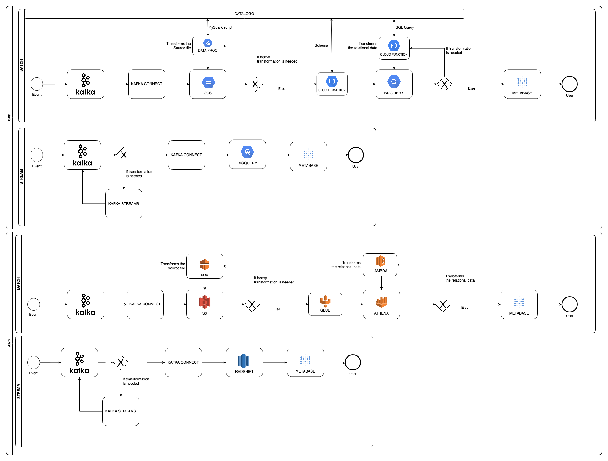

# Challenge 1 - Data Architecture Design
A classic yet modern data lake architecture that meet all the desired requirements.

## Batch Pipeline 

All the messages transitioning inside Kafka can be easily persisted in a bucket (cloud storage, s3 or HDFS) using Kafka Connect, an open-source confluent application thought to compose the Kafka ecosystem.

After the data is persisted in its raw-format, if it's size cant fit in memory or some real complex transformation is needed, a spark based solution can be used to do the hard work. I indicated some cloud solutions (EMR, or Data Proc) that could easily make an ad-hoc cluster available to that matter. You can also see the Data Proc exchanging messages with the catalog - and that's important to make data governance possible.

Once all the hard work is done by the spark cluster - if needed - and wrote back to the storage, the data should be ready to be ingested to a database like BigQuery or even Athena. In GCP I used a cloud function to apply the schema, held by the catalog. AWS has a solution to that problem - glue - a severless catalog application that can not only hold and apply the schema for each asset but perform several data-quality checks.

Getting into the relational database takes us almost there in the road to the data marts, but we know that our analytics needs are a little more complicated than just some asset tables, we commonly need to transform the data, change names and types, aggregate and pivot the data so it can be in a ready to be queried format. 
Thats were the catalog comes in again, orchestrating the data from the called staging area (were the ingested data comes in) to the data marts - and thats done with several SQL transformations and aggregations.

One quick example: Let's say that our leads data just got from the bucket to bigquery on the dataset `Leads_staging`, when that happens the catalog is triggered applying some SQL aggregation with our contracts data and write the query results to the `Funnel_data_mart` dataset. The `funnel_data_mart` is the one that our analysts will have access to!

Nice! Now our events are in a relational database ready to be queried by our analysts and shown to the rest of the company by some BI solution, like Metabase.

Implementation costs can vary a lot depending on the ammount of assets - each one represent a full pipeline with bucket partition, pyspark transformation scripts, schemas and transformation queries. And the ammount of data itself - if the volume is not that big we can save a lot of time leaving spark transformations behind.
That said I have implemented a MVP solution just like the one presented with 3 people in a month and half.

## Streaming Pipeline

As we need this data to be available quickly we treat if a little bit differently.
All the transformation is done with Kafka Streams, a framework design to this principle - transform data in streaming pipelines. As you should have thought, this certainly reduce the range of transformations we can perform on the data before it reaches the data marts. 
With this design the data should be in a ready to be ingested and consume format after the transformation, so if you want an aggregated metric of sales per region - the schema of the messages after the Kafka Streams pipeline should be really close to the presented to the company and once it is we use Kafka Connect to insert this metric directly inside of the database making it ready to consumed in just a few seconds after the event occurred!

Implementation costs can vary a lot depending on the kind of transformation Kafka Streams has to do before make the indicator available but its implementation tends to be much easier than the batch one since we only have to configure the environment and code the transformation (and the schema used to ingest the data to the database). A MVP should be ready in 3 weeks with a 3 people team. (Its good to remember that scaling the team does not have a linear impact on the deadline, its easy to think that 6 people wouldnt be able to do it in a week and a half but many real world cases show us thats not true most of the times)
